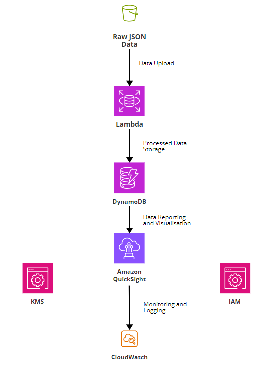

# How to Run the Source Code Locally

## Prerequisites
- **Python 3.x** installed on your system
- Required Python packages:
  - `requests`
  - `pandas`
  - `openpyxl`

## 1. Steps to Set Up and Run the Code

1. **Clone the repository**: Open a terminal in your code editor and run the following commands:
   ```bash
   git clone <repository-url>
   cd <repository-directory>

2. **Run the Python script**: Copy and paste the below command into your terminal
    ```python
    python restaurant.py

## 2. How I would design/deploy this using cloud services + decisions/considerations made when designing the solution
The steps for deployment and design that I took into consideration are:
a. Data storage
b. Data processing and transformation
c. Data extraction
d. Data querying
e. Data visualisation
f. Data monitoring/maintenance.

For the first step, I would use AWS S3 to store raw JSON files and Excel files as it offers scalability for handling large volumes of data. Some considerations
when designing the solution include ensuring that there are proper security measures in place, such as encryption and access controls. For the second step, 
I would use AWS Lambda to process the data as it does not require server management and provides scalability. Some considerations include
optimizing functions to efficiently handle different data sizes. I'd use Python scripts, namely the restaurant.py script to parse JSON data and extract relevant information, 
and then transform the extracted data into structured formats for further analysis or reporting. In order to properly store and query the data, I considered using
a managed database such as AWS RDS for structured data storage. Some considerations include developing a database schema that can efficiently store and query 
restaurant and event data, as well as a database solution that can scale with increasing data volumes. For data visualisation and repoting, AWS Quicksight could be used to
create reports/dashboards. Finally, cloud monitoring tools such as AWS CloudWatch can be used to track the performance of the data processing workflow. The main considerations made when designing the solution include the cost-effectiveness, scalability, and efficiency of the above services. 

## 3. AWS Architecture Diagram


